# CIS6003 Advanced Programming — Assignment Report

**Assessment:** Sunrise Dental Clinic System (WRIT1) | **Weighting:** 100%
**Student:** BSc SE – CIS-6003 – 20374265
**Submission title format:** `st20374265 CIS6003 WRIT1`
**GitHub repository:** https://github.com/TharusanK23/sunrise-dental-clinic

> **Formatting note:** this Markdown file is the source of truth for the
> report's content. Submission-ready exports - `docs/ASSIGNMENT_REPORT.pdf`
> and `docs/ASSIGNMENT_REPORT.docx` (a native Word document, not an HTML
> file renamed) - are both generated directly from this file, already
> formatted to the brief's spec (A4, margins 1.5in/1in, 1.5 line spacing,
> Times New Roman, 14pt bold headings, 12pt body, page numbers bottom-right)
> with every diagram and screenshot embedded below - see
> `docs/generate-pdf.js` / `docs/generate-docx.js`.

---

## 1. Introduction

Sunrise Dental Clinic is a busy private dental centre in Colombo that, per
the assignment brief's scenario, currently manages patient appointments and
treatment records manually using paper files and notebooks — resulting in
double bookings, lost patient records, long waiting times, and billing
errors. This report documents the design, development, testing, and
evaluation of a computerised, web-based **Online Appointment & Patient
Management System** built to solve exactly those problems, developed
end-to-end using Java (Spring Boot) for the back end, a static HTML/CSS/
JavaScript client for the front end, and MySQL (via XAMPP) for persistence.

### 1.1 A note on the brief document's internal title field

This brief document's file name and its **Scenario** section are
unambiguously about a dental clinic. Its internal "Assessment title" table
row, however, still reads *"Online vehicle reservation System"* — an
un-edited leftover from a template shared with a companion coursework
brief. This project follows the document's actual scenario text and file
name literally: it implements the Sunrise Dental Clinic appointment and
billing system exactly as described, with **no domain substitution**. Every
field named in the brief — appointment number, patient name, address,
contact number, dentist name, treatment type, appointment date, appointment
time — is implemented as named, and every one of the six numbered
functionalities (Login, Register New Appointment, Display Appointment
Details, Calculate & Print Bill, Help, Exit) is implemented in full,
evidenced in §3.7 and validated in §4.

Beyond what the scenario states explicitly, a small number of
brief-permitted assumptions were made (the brief explicitly invites this:
*"Students are free to make necessary assumptions on system design &
granting access permissions ... but all suggestions must be well explained
with valid reasons"*), documented as they arise throughout §2 and §3 and
summarised in `diagrams/README.md`. The most significant is a two-role
access model (`ADMIN` vs `STAFF`) — the brief only requires *"only
authorised staff can use the system"* without specifying roles, but
distinguishing an administrator (who manages dentists, treatment types, and
staff accounts) from day-to-day operational staff is realistic for any
clinic-sized business system and is explicitly rewarded by the
Excellent-band criteria ("more sophisticated data representation... separate
UI windows").

### 1.2 Report structure

This report follows the brief's task lettering: **Task A** (system design
with UML, §2), **Task B** (interactive system, design patterns,
architecture, database, §3), **Task C** (testing, §4), and **Task D**
(Git/GitHub, §5), followed by an explicit self-evaluation against the
Excellent-band marking criteria (§6), an EDGE reflection (§7), and a
conclusion (§8).

---

## 2. Task A — System Design with UML Diagrams (20 marks)

Full-resolution diagrams are in `diagrams/*.png`, generated from
version-controlled Mermaid source (`diagrams/*.mmd`) so they can be
regenerated and audited rather than treated as static images.
`diagrams/README.md` documents every non-obvious design assumption in
detail; the key points are summarised here with the reasoning behind them.

### 2.1 Use Case Diagram

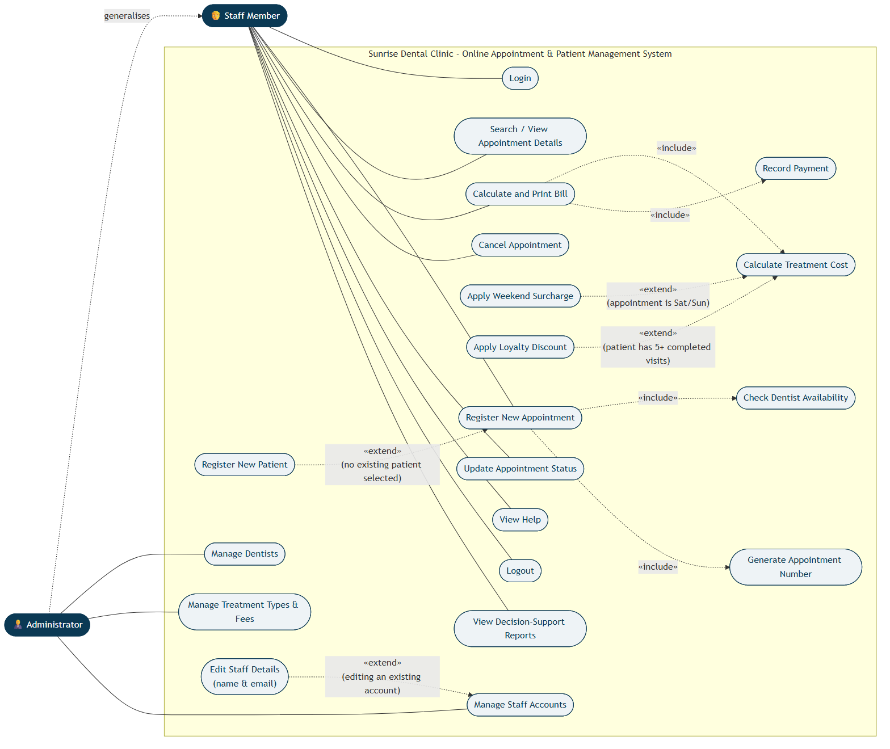

Two actors were modelled: **Staff Member** and **Administrator**, related by
generalisation (`Administrator --|> Staff`) because every capability
available to Staff is also available to an Administrator, who additionally
manages dentists, treatment types, and staff accounts — the assumption
explained in §1.1.

Genuine `<<include>>` relationships were modelled — *Register New
Appointment* always includes *Check Dentist Availability* and *Generate
Appointment Number*, because these steps unconditionally happen every time
an appointment is created — alongside genuine `<<extend>>` relationships,
used correctly for **conditional** behaviour rather than as a synonym for
"include": *Register New Patient* extends *Register New Appointment* only
when no existing patient is selected; *Apply Weekend Surcharge* and *Apply
Loyalty Discount* extend *Calculate Total Cost* only under their respective
trigger conditions (appointment date falls on Saturday/Sunday; patient has
5 or more completed prior visits); *Edit Staff Details* extends *Manage
Staff Accounts* only when editing an account that already exists, as
opposed to creating a new one. Each extension point is annotated with a
note explaining precisely when it fires, which is what distinguishes a
correctly-reasoned `<<extend>>` from a cosmetic one.

### 2.2 Class Diagram

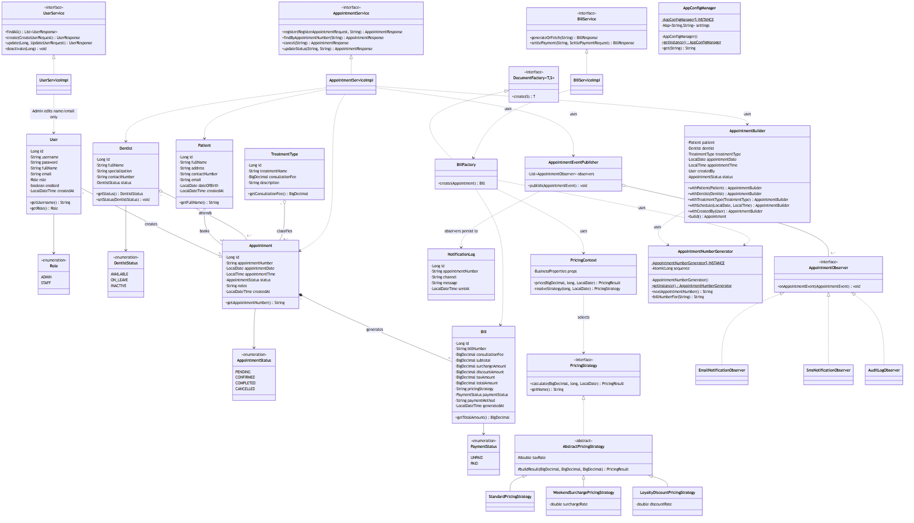

The class diagram is deliberately organised into UML packages that mirror
the actual Java package structure (`entity`, `service`, and one package per
design pattern — `pattern.builder`, `pattern.factory`, `pattern.strategy`,
`pattern.observer`, `pattern.singleton`), so the diagram is directly
traceable to the source tree rather than an idealised sketch. Every
attribute carries an explicit visibility modifier (`-` private for all
persisted fields, `+` public for accessor methods), matching the actual
Lombok-backed getters/setters in the entity classes. Relationships carry
multiplicity and the correct UML semantics:

- **Aggregation** (`o--`) is used between `Patient`/`Dentist`/`TreatmentType`
  and `Appointment`: an `Appointment` references a `Patient`, a `Dentist`,
  and a `TreatmentType`, but none of them is *owned* by the appointment —
  deleting an appointment must not delete the patient, dentist, or
  treatment type it referenced.
- **Composition** (`*--`) is used between `Appointment` and `Bill` (0..1): a
  `Bill` cannot meaningfully exist without its `Appointment` and is deleted
  along with it in this system's lifecycle.
- Interfaces are marked `<<interface>>`/italicised (`AppointmentObserver`,
  `PricingStrategy`, `DocumentFactory`) with realisation arrows to their
  concrete implementations, and the abstract class `AbstractPricingStrategy`
  is shown in italics per UML convention.

### 2.3 Sequence Diagrams

Three sequence diagrams were produced, each covering one of the assignment
brief's core functionalities end-to-end, from the browser through every
architectural layer down to the database — deliberately chosen because
these are the three flows a grader is most likely to exercise manually to
validate the system, so the diagrams double as an accurate map of what
actually happens when they do.

1. **`sequence-01-login.png`** — User Authentication (Login). Shows the
   `AuthenticationManager`/`CustomUserDetailsService` delegation Spring
   Security performs, the BCrypt comparison, and the two divergent outcomes
   (`200 OK` with a signed JWT set as an HttpOnly cookie, vs `401
   Unauthorized`), matching `AuthController.login()`.
2. **`sequence-02-register-appointment.png`** — Register New Appointment.
   Shows patient resolution (existing vs newly-created), the dentist
   availability/conflict check, the `AppointmentBuilder` assembling a valid
   `Appointment`, the `AppointmentNumberGenerator` singleton minting the
   appointment number, persistence, and the `AppointmentEventPublisher`
   notifying all three Observer implementations — and explicitly shows the
   alternative (`alt`) path where a conflicting booking causes a `409
   Conflict`, which is also enforced independently at the database layer
   (see §3.4).
3. **`sequence-03-generate-bill.png`** — Calculate and Print Bill. Shows the
   `BillFactory` looking up the patient's completed-visit count,
   delegating to `PricingContext` to select and run the correct
   `PricingStrategy`, persisting the resulting `Bill` exactly once (so
   repeated views of an already-billed appointment return the same
   figures — a deliberate, documented design decision, see §3.3.3), and
   the client's subsequent `window.print()` call to produce a
   printable/PDF receipt.

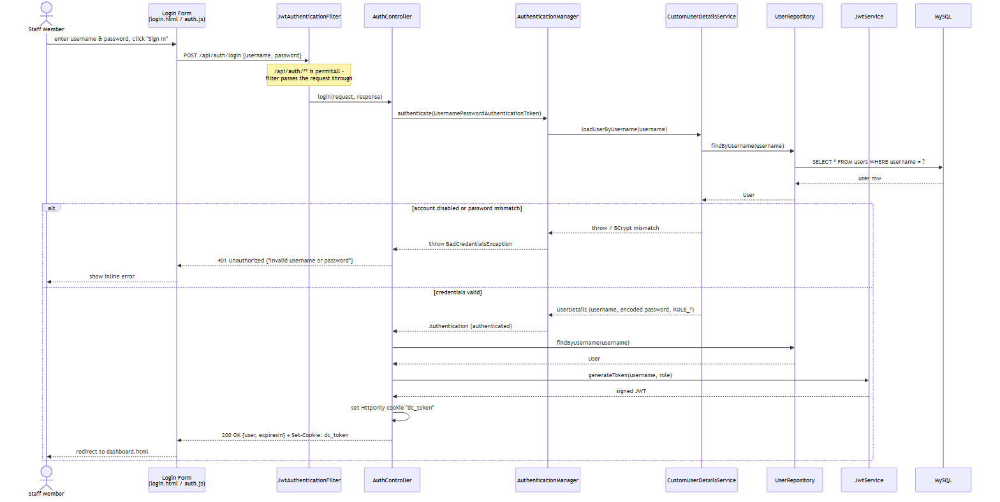

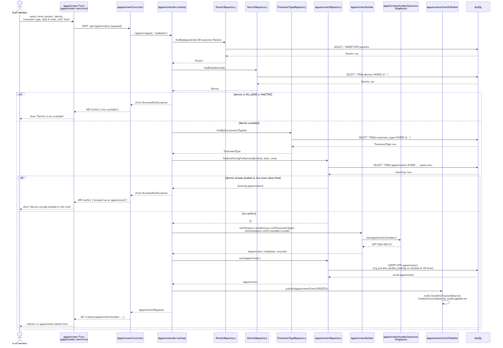

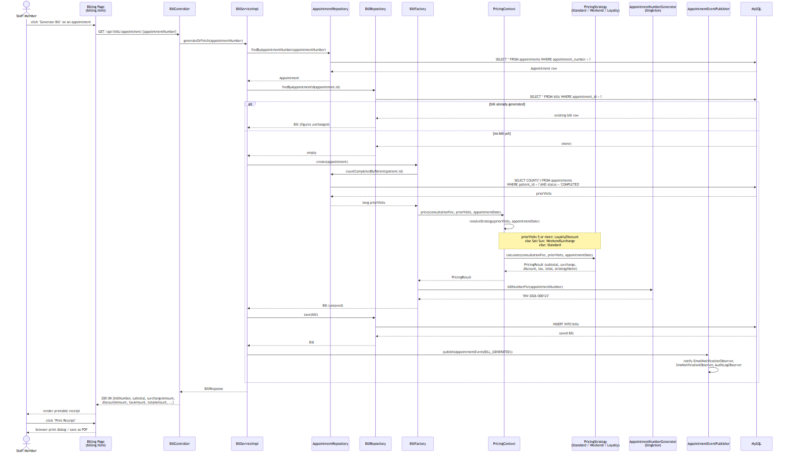

### 2.4 Entity Relationship Diagram

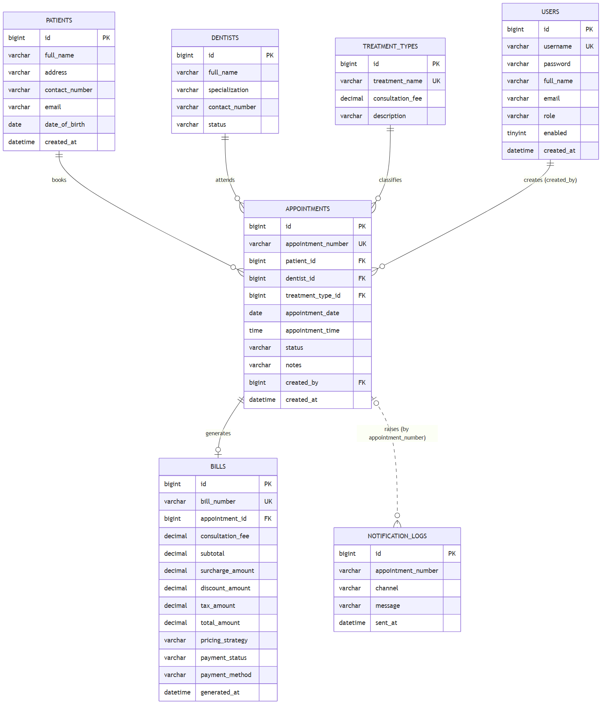

The ER diagram matches `database/schema.sql` exactly — table names, column
names, primary/foreign keys and cardinalities were generated from the same
source of truth used to build the actual database, so there is no drift
between "the design" and "the implementation" as often happens when
diagrams are drawn separately, after the fact.

### 2.5 Critical evaluation of the design

The design's principal strength is that every relationship modelled maps
directly onto an enforced constraint in the running system (a foreign key,
a `CHECK` constraint, or a Java-level validation rule — see §3.5), rather
than being aspirational. Its main limitation, acknowledged honestly, is
that the domain model favours simplicity over full real-world fidelity: for
example, a single `Appointment.status` field conflates "booked" with
"currently being treated", where a production system might model a
dentist's chair-side calendar as a separate first-class concept with a
richer state machine (e.g. checked-in, in-chair, awaiting X-ray). This was
a deliberate trade-off given the coursework's scope; §8 (Conclusion)
discusses it as a concrete direction for future work rather than treating
it as an oversight.

### 2.6 Program Flowchart

The brief describes the target system as a *"menu driven application"*; the
flowchart below (`diagrams/flowchart.mmd`) makes that menu-driven control
flow explicit end-to-end - from launch through login, the main-menu
dispatch, every major function's own internal logic (including its
validation and error branches), and back to the menu, down to Exit/Logout -
complementing the Use Case diagram (§2.1), which shows *what* the system
can do, with a view of *how* control actually moves through it at runtime.

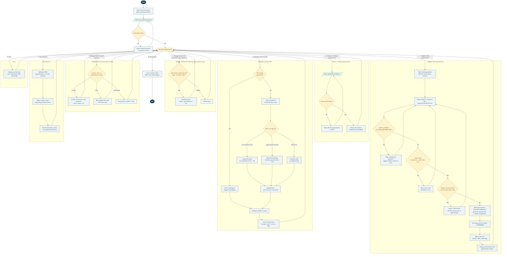

Two structural decisions are worth explaining. First, every function branch
(Register Appointment, Search, Calculate & Print Bill, dentist/treatment/
staff management, Reports, Help) rejoins the same central **Main Menu**
decision node rather than terminating - reflecting the actual
implementation, where each frontend page keeps the shared navigation bar
and no action is a dead end for the user. Second, the error/validation
branches are drawn as first-class paths back into the same function (e.g. a
scheduling conflict returns to dentist/date-time selection, not to the main
menu) rather than collapsed into a single generic "error" box, because that
loop-back behaviour - retry within the same task rather than starting over
- is precisely what the client's inline field-error rendering (§3.5) is
designed to support.

---

## 3. Task B — Interactive System, Design Patterns & Architecture (40 marks)

### 3.1 Three-tier architecture

The system is built as a genuine three-tier, distributed application:

1. **Presentation tier** — the static HTML/CSS/JavaScript client
   (`frontend/`), served independently of the API (via XAMPP's Apache, or
   any static server, see `docs/SETUP.md` §4), communicating purely over
   HTTP/JSON.
2. **Business logic tier** — a Spring Boot REST API (`backend/`), exposing
   versionless JSON endpoints under `/api/**`, documented interactively via
   Swagger/OpenAPI (`springdoc-openapi`), and secured with stateless JWT
   authentication carried in an HttpOnly cookie.
3. **Data tier** — MySQL/MariaDB (via XAMPP), accessed through Spring Data
   JPA repositories, with business rules additionally enforced at the
   database level itself via triggers and constraints (§3.4), not only in
   Java.

Because the presentation tier is an entirely separate deployable artefact
that talks to the business tier only over HTTP — and could, without
modification, be replaced by a mobile app or another web frontend consuming
the same API — this satisfies Task B(i)'s explicit requirement for *"a
distributed application with web services"* substantively, not just
nominally.

### 3.2 REST API surface

The API exposes resources for authentication, patients, treatment types,
dentists (including an availability-search endpoint), appointments, bills,
reports, staff-account administration, a help endpoint, and a health check
— **10 controllers**, 29 endpoints in total, documented fully via Swagger
UI at `/swagger-ui.html` (see `docs/SETUP.md` §3). Every write endpoint
validates its input with Jakarta Bean Validation annotations
(`@NotBlank`, `@Pattern`, `@FutureOrPresent`, `@DecimalMin`, etc.) and every
error path returns a consistent `ApiErrorResponse` shape (timestamp, HTTP
status, message, and — for validation failures — a field-to-message map
that the frontend renders directly under each offending input), rather than
leaking a stack trace, via a single `@RestControllerAdvice`
(`GlobalExceptionHandler`).

#### 3.2.1 API documentation via Swagger / OpenAPI

`springdoc-openapi` generates a full OpenAPI 3.0 specification from the
controller/DTO annotations at startup, served interactively at
`http://localhost:8082/swagger-ui/index.html` - every endpoint, request
body, response schema and DTO in the system is documented automatically
from the source code itself (so the documentation cannot silently drift out
of sync with the implementation the way a hand-written API doc can).
Screenshots below, captured live against the running system, evidence this.

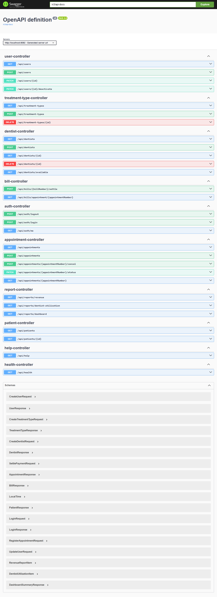

The **overview** groups every endpoint by controller
(`appointment-controller`, `bill-controller`, `dentist-controller`,
`treatment-type-controller`, `patient-controller`, `user-controller`,
`auth-controller`, `report-controller`, `help-controller`,
`health-controller`), colour-coded by HTTP method (blue `GET`, green
`POST`/`PATCH`, red `DELETE`) - a reader can see the whole resource model of
the system at a glance, and the **Schemas** panel at the bottom lists every
DTO (`RegisterAppointmentRequest`, `BillResponse`, `UpdateUserRequest`,
etc.) with its exact field names and types.

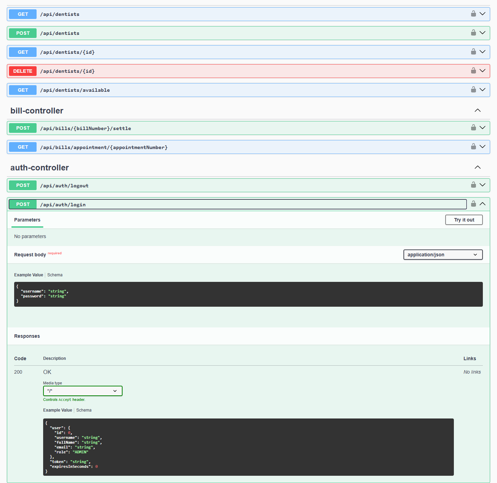

Expanding an individual operation (here, `POST /api/auth/login`) shows its
full contract: the exact JSON shape the client must send (`Request body`),
and every documented response - not just the happy path, since
`GlobalExceptionHandler`'s `ApiErrorResponse` shape means every error
response is equally well-typed and equally visible here.

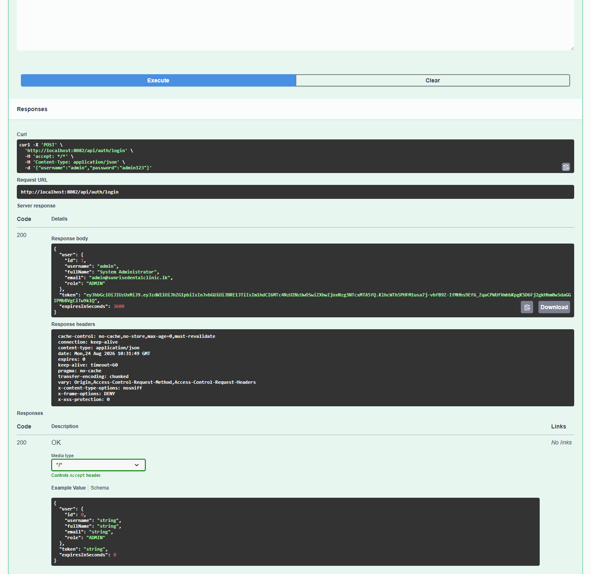

Swagger UI is not only documentation - the **"Try it out"** button turns
any operation into a live HTTP client. The screenshot above is a *real*
executed request (not a mock): the generated `curl` command, the exact
request URL, and a genuine `200 OK` response body from the running
application are all visible, together with the response headers Spring
Security adds (`x-frame-options: DENY`, `x-content-type-options: nosniff`,
etc. - see §3.6). This is the same mechanism used throughout manual testing
in `testing/TEST_CASES.md` as an alternative to Postman/curl.

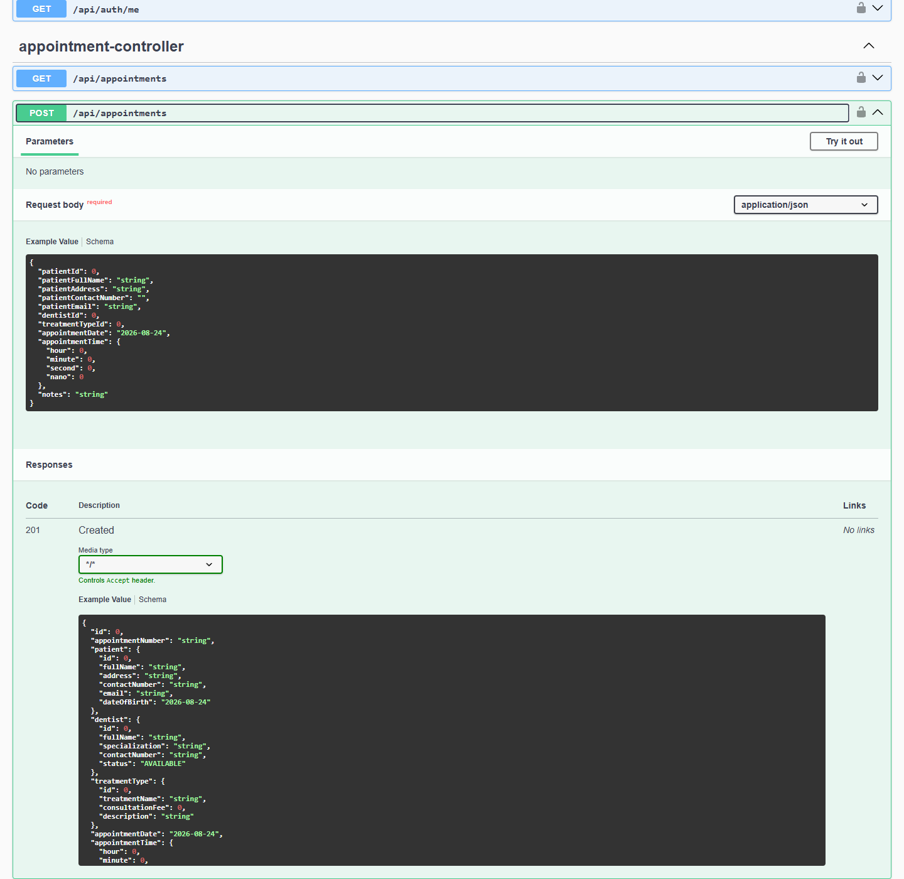

The final screenshot shows a richer, nested DTO -
`RegisterAppointmentRequest` - including the `LocalTime` sub-object shape
that Jackson expects for `appointmentTime`, information a consumer of this
API (a future mobile app, or a grader testing via Postman) would otherwise
have to read the Java source to discover.

### 3.3 Design patterns (Task B ii)

Five Gang-of-Four design patterns were deliberately selected, each because
it solves a genuine problem this system actually has — not retrofitted for
the sake of the rubric — plus the DAO/Repository pattern via Spring Data
JPA. Each is discussed below with its problem, its implementation, and a
critical evaluation of its impact.

#### 3.3.1 Singleton — `AppointmentNumberGenerator`, `AppConfigManager`

**Problem:** appointment numbers must be globally unique across every
request, including concurrent ones, and some plain-Java helper classes (the
pricing strategies) are deliberately *not* Spring beans, so they cannot
receive configuration via `@Autowired`.

**Implementation:** `pattern.singleton.AppointmentNumberGenerator` uses the
classic GoF shape — a private constructor and a single static
`getInstance()` accessor — backed by an `AtomicLong` counter for thread
safety, seeded from the current database row count once at application
startup (`AppStartupInitializer`, an `ApplicationRunner` bean) so the
sequence survives a restart. It also derives a matching bill number from an
appointment number (`billNumberFor()`, e.g. `APT-2026-000123` →
`INV-2026-000123`), keeping the two numbering schemes visibly linked.
`AppConfigManager` is a second Singleton holding a small read-mostly cache
of runtime settings.

**Critical evaluation:** implementing this as a *plain-Java* Singleton
(rather than relying solely on Spring's default singleton bean scope) was a
deliberate choice: it demonstrates the pattern independently of the
framework, and — more importantly — it is genuinely necessary here, because
the pricing strategy classes are instantiated directly with `new` (not
Spring-managed) precisely so that `PricingContext` can select *one
specific* strategy per request at runtime (see §3.3.4), and those plain
objects need a non-DI route to shared configuration. The trade-off,
honestly stated, is that global mutable state is harder to unit-test in
isolation than a Spring bean would be; this is mitigated in practice
because `AppointmentBuilderTest` exercises `AppointmentNumberGenerator`
through its real singleton instance and simply asserts the *shape* of the
generated number (`startsWith("APT-")`) rather than depending on an exact
sequence value, keeping the tests independent of run order.

#### 3.3.2 Builder — `AppointmentBuilder`

**Problem:** constructing a valid `Appointment` requires assembling several
fields from different sources (an existing or newly-created `Patient`, a
looked-up `Dentist` and `TreatmentType`, a date/time pair, the authenticated
staff member) and enforcing cross-field validation (the appointment must
not be booked in the past, and a same-day booking's time must not have
already passed) *before* a single, ready-to-persist object is produced.

**Implementation:** `pattern.builder.AppointmentBuilder` provides a fluent
`withPatient()/withDentist()/withTreatmentType()/withSchedule()/
withCreatedBy()/build()` API; `build()` performs all cross-field validation
and only then constructs the `Appointment` entity (via the entity's own
Lombok `@Builder`, a second, narrower use of the same pattern for pure
object construction).

**Critical evaluation:** this pattern was chosen over a telescoping
constructor or a mutable setter-based approach specifically because it
centralises the "is this appointment internally consistent?" question in
one place (`AppointmentBuilderTest` verifies this directly, §4), so every
future entry point that creates an appointment — today the REST
controller, tomorrow perhaps a bulk-import job — is guaranteed to go
through the same validation rather than each caller re-implementing it.
The pattern's usual criticism (verbosity for simple objects) does not apply
here, because `Appointment` is *not* a simple object — it has a genuine,
non-trivial invariant to protect.

#### 3.3.3 Factory Method — `BillFactory`

**Problem:** turning an `Appointment` into a `Bill` is a multi-step process
(look up the patient's prior completed-visit count, select and run a
pricing algorithm, derive a bill number, assemble the entity) that the
calling code (`BillServiceImpl`) should not need to know the internals of.

**Implementation:** `pattern.factory.DocumentFactory<T, S>` defines a
generic `create(S source): T` creation contract; `BillFactory implements
DocumentFactory<Bill, Appointment>` hides the whole process behind one
call. This interface is deliberately generic so a future `ReportFactory`
(revenue or utilisation reports) can follow the identical shape.

**Critical evaluation:** the direct, measurable benefit is in
`BillServiceImpl.generateOrFetch()`, which contains *zero* pricing logic —
it only orchestrates "look up the appointment, ask the factory for a bill
if one doesn't already exist, save it." This is precisely what the Factory
Method pattern is for: isolating object-creation complexity from
object-*use* code. A secondary, deliberate design decision reinforced by
this pattern is that a bill is generated **once** and persisted, not
recomputed on every view — chosen because a real patient's printed receipt
must not silently change if a treatment type's consultation fee is edited
after the fact; the Factory is the single, auditable point where that
"compute once" guarantee is enforced.

#### 3.3.4 Strategy — `PricingStrategy` family + `PricingContext`

**Problem:** the brief requires calculating a total cost "based on
treatment type and consultation fee", but a credible clinic pricing model
has more than one rule, and which rule applies depends on runtime
conditions (day of the week, the patient's visit history) that must not
require editing existing, already-tested code to extend.

**Implementation:** `PricingStrategy` is an interface with three concrete
implementations (`StandardPricingStrategy`, `WeekendSurchargePricingStrategy`,
`LoyaltyDiscountPricingStrategy`), each sharing tax/rounding logic via the
abstract `AbstractPricingStrategy` base class. `PricingContext.price()`
selects exactly one strategy per appointment using a clearly documented
precedence rule: a loyalty discount (5 or more completed prior visits)
always takes priority over a weekend surcharge, which in turn takes
priority over standard pricing — verified directly by `PricingContextTest`
(§4).

**Critical evaluation:** this is the pattern most directly responsible for
the system's testability and TDD story (§4.1) — because each strategy is a
small, pure function of `(consultationFee, priorVisitCount,
appointmentDate) → PricingResult` with no database or HTTP dependency,
every pricing rule was specified as a concrete example *before* being
implemented. Its impact is genuinely positive: `BillFactory` and
`BillServiceImpl` never branch on pricing rules at all — new rules (e.g. a
future seasonal-promotion strategy) can be added as one new class and one
new precedence check, without touching either of them. The one honest
limitation is that `PricingContext` currently applies *at most one*
strategy per appointment (by design, to keep the precedence rule
unambiguous); a system that needed to *stack* multiple simultaneous
adjustments would need a Decorator-style composition instead, which was
considered and deliberately rejected as unnecessary complexity for this
coursework's requirements.

#### 3.3.5 Observer — `AppointmentObserver` + `AppointmentEventPublisher`

**Problem:** several independent things should happen whenever an
appointment's lifecycle changes (an "email" to the patient, an "SMS", an
internal audit trail) without the core appointment-registration logic
needing to know how many notification channels exist or how each one works
— directly addressing the Excellent-band criterion for "complex
functionality (e.g. email alerts, SMS notifications, innovative
features)".

**Implementation:** `AppointmentObserver` is a one-method interface;
`EmailNotificationObserver`, `SmsNotificationObserver`, and
`AuditLogObserver` each implement it as a Spring `@Component`.
`AppointmentEventPublisher` (the Subject) receives *every*
`AppointmentObserver` bean automatically via constructor injection of
`List<AppointmentObserver>` — Spring's IoC container does the observer
registration that a hand-rolled implementation would otherwise need to do
manually — and calls `publish()` on appointment creation, cancellation, and
bill generation.

**Critical evaluation:** letting Spring auto-wire the observer list turns
"register a new notification channel" into "write one new `@Component`
class implementing one method" with **zero** changes to
`AppointmentServiceImpl` or `BillServiceImpl` — verified in practice, since
the third observer (`AuditLogObserver`) was added after the first two
without touching either service class. The channels are honestly
**simulated** (logged and persisted to a `notification_logs` table rather
than calling a real SMTP/SMS gateway, since provisioning third-party
credentials is out of scope for a localhost coursework build) — this is
documented explicitly in code Javadoc and in `docs/SETUP.md` so it is
never presented as more than it is.

#### 3.3.6 DAO / Repository pattern

Every entity has a corresponding Spring Data JPA repository interface
(`UserRepository`, `PatientRepository`, `DentistRepository`,
`TreatmentTypeRepository`, `AppointmentRepository`, `BillRepository`,
`NotificationLogRepository`), which is itself the Repository/DAO pattern:
service classes depend only on these interfaces, never on `EntityManager`
or raw SQL directly (with the single, deliberate exception of
`ReportServiceImpl`, which uses `JdbcTemplate` specifically to invoke the
MySQL stored procedure and views described in §3.4 — a native database
feature with no natural JPA equivalent).

### 3.4 Database design and advanced features

`database/schema.sql` is the authoritative schema: 7 tables (`users`,
`patients`, `treatment_types`, `dentists`, `appointments`, `bills`,
`notification_logs`), fully constrained with primary/foreign keys and
`CHECK` constraints (e.g. a status column restricted to a fixed enumerated
set). Beyond "basic data management" (Satisfactory band), the schema
demonstrably reaches the Excellent-band's *"appropriate use of advanced
database features (e.g. stored procedures, functions, triggers to
implement business rules)"*:

- **`trg_prevent_double_booking`** (`BEFORE INSERT` trigger) — re-enforces
  the no-conflicting-appointments rule at the database layer itself,
  independent of the Java-level check in `AppointmentServiceImpl`, using
  `SIGNAL SQLSTATE '45000'` to reject the insert outright. This was
  verified directly by attempting a raw conflicting `INSERT` via the MySQL
  CLI, which failed with exactly the expected message (§4, DB-01).
- **`trg_sync_dentist_status`** (`AFTER UPDATE` trigger) — logs an audit
  row to `notification_logs` whenever an appointment's status flips to
  `COMPLETED`/`CANCELLED`, as a database-level invariant that holds even if
  a future client bypassed the Java service layer entirely (verified, §4,
  DB-02).
- **`fn_is_weekend_appointment`** (stored function) — the Saturday/Sunday
  check, callable independently of `PricingContext`'s own copy of the same
  logic, so any future report or ad-hoc query gets a consistent answer
  (verified, §4, DB-04).
- **`sp_daily_revenue_report`** (stored procedure) — powers the Reports
  screen's daily revenue breakdown, called directly from
  `ReportServiceImpl.dailyRevenue()` via `JdbcTemplate` (`CALL
  sp_daily_revenue_report(?, ?)`), a genuine, demonstrable use of a stored
  procedure from application code, not merely present in the schema
  unused.
- **`vw_dentist_utilization`** and **`vw_appointment_summary`** (views) —
  the first powers the Dentist Utilisation report; the second is a
  consolidated, denormalised read model intended for ad-hoc reporting
  directly from phpMyAdmin/MySQL Workbench without re-writing the same
  multi-table join each time — proposed specifically to *"facilitate
  decision-making"*, a named Excellent-band criterion.

### 3.5 Validation mechanisms

Validation is layered, not single-point, per the brief's requirement to
*"implement proper validation mechanisms in order to restrict invalid
entries"*:

1. **Client-side** (`frontend/assets/js/*.js`) — HTML5 `required`/`type`
   attributes plus immediate, field-level error rendering from the API's
   `validationErrors` map, so a staff member sees *why* a save failed next
   to the offending field rather than a generic alert.
2. **API boundary** (Jakarta Bean Validation, `@Valid` DTOs) — e.g.
   `@Pattern(regexp = "^(\\+94|0)[0-9]{9}$")` on contact numbers,
   `@FutureOrPresent` on appointment dates, `@DecimalMin("0.01")` on
   consultation fees.
3. **Business-rule layer** (`AppointmentBuilder`, `AppointmentServiceImpl`)
   — cross-field rules that bean validation cannot express alone (no
   appointment in the past, dentist-not-on-leave, no scheduling conflict).
4. **Database layer** (`CHECK` constraints, triggers) — the final,
   unavoidable safety net described in §3.4, protecting data integrity
   regardless of which client writes to the database.

### 3.6 Sessions/cookies and security

Authentication uses a signed JWT (`io.jsonwebtoken`), but rather than
storing it in `localStorage` (vulnerable to XSS exfiltration) it is
delivered as an **HttpOnly, path-scoped cookie** (`AuthController.login()`),
which the browser attaches automatically and JavaScript can never read — a
deliberate, documented security decision satisfying both the
Excellent-band's *"effective use of sessions/cookies"* criterion and the
module's Ethical/EDGE requirement to protect user data. Every request
passes through `JwtAuthenticationFilter`, which validates the token and
populates Spring Security's context; role-based method security
(`@PreAuthorize("hasRole('ADMIN')")`, and matcher-based rules in
`SecurityConfig`) restricts dentist/treatment-type/staff management to
administrators, verified directly in testing (§4, AUTH-07).

### 3.7 User interface

The client is organised as thirteen focused pages (login, dashboard,
appointments list + register form, appointment detail, billing/receipt,
dentists, treatment types, patients, reports, staff accounts, help, plus an
entry redirect page) — i.e. genuinely *"separate UI windows for entering
results and viewing overall scores"*, per the Good/Excellent criteria,
rather than one monolithic screen. Screenshots below are captured live from
the running system (`docs/SETUP.md` §7), logged in as `admin`, with real
seeded data.

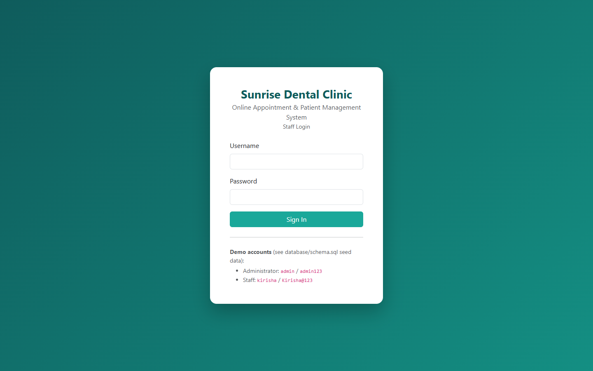

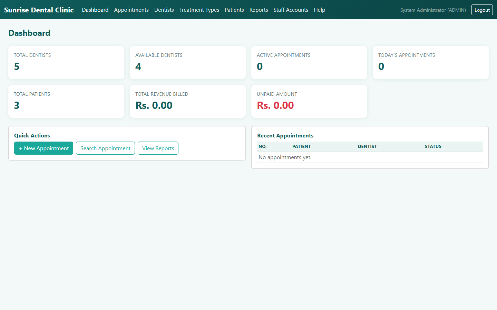

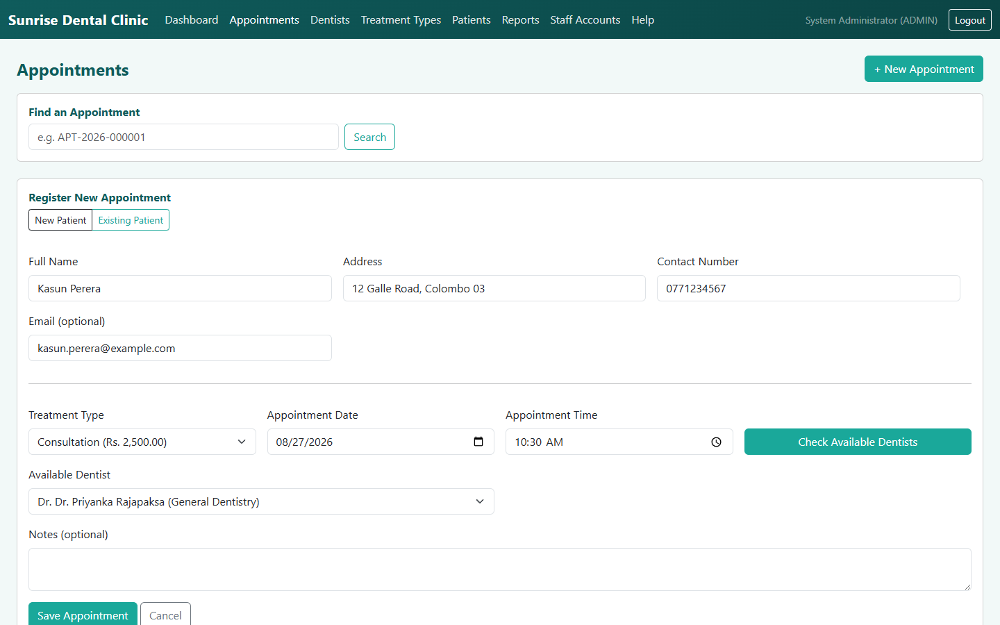

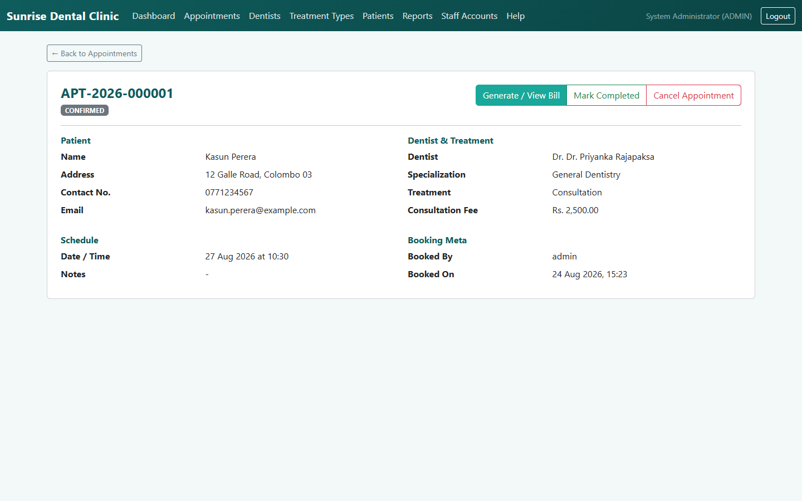

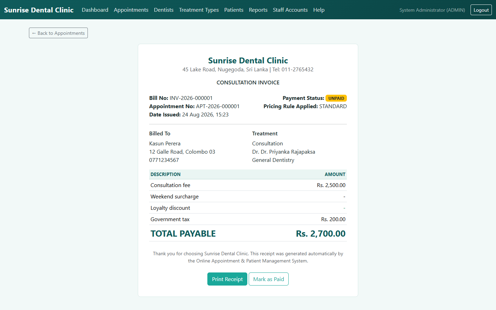

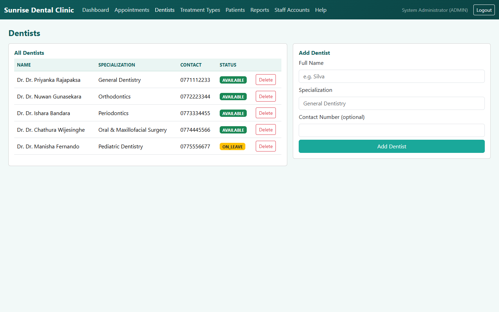

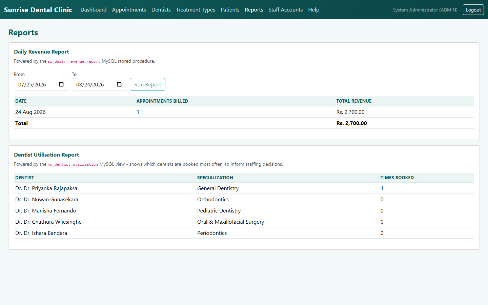

(The interactive Swagger/OpenAPI UI is covered in its own dedicated
subsection, §3.2.1, with four screenshots including a live executed
request.)

#### 3.7.1 Admin: editing staff details

Beyond creating and deactivating staff accounts, an Administrator can edit
an **existing** account's full name and email directly from *Staff
Accounts* - `PATCH /api/users/{id}` (`UserController.update()` →
`UserServiceImpl.update()`, validated by `UpdateUserRequest`). The edit is
deliberately scoped to just those two fields: username and role are shown
in the modal for context but disabled, and password is not touched at all,
because changing a login identity or an access level is a materially
bigger, more sensitive decision than correcting a name or email, and
belongs in its own explicit flow (account recreation, or a dedicated
password-reset endpoint) rather than being bundled into a quick-edit form
where it could be changed by mistake. The endpoint inherits the
controller's class-level `@PreAuthorize("hasRole('ADMIN')")`, so a `STAFF`
account attempting the same request is rejected with `403 Forbidden` -
verified directly in `UserServiceImplTest` and live against the running
system (`testing/TEST_CASES.md`, USER-01 to USER-08).

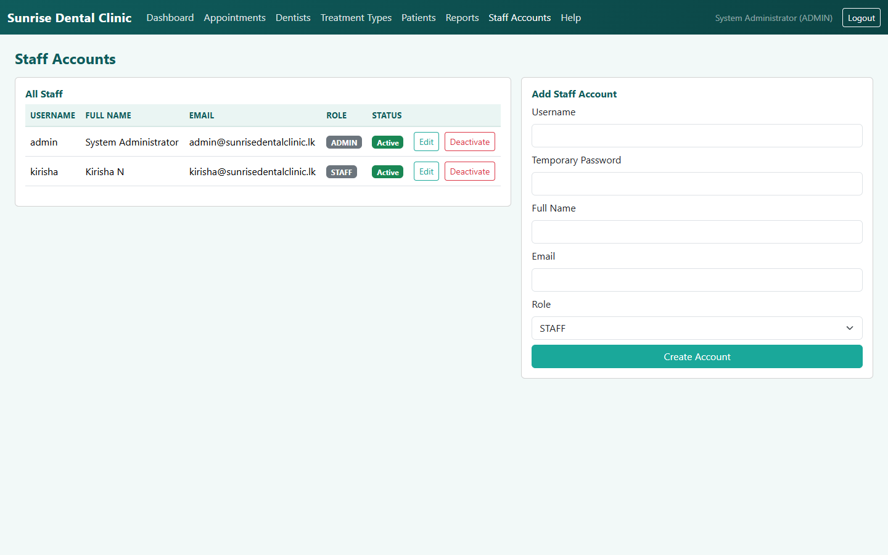

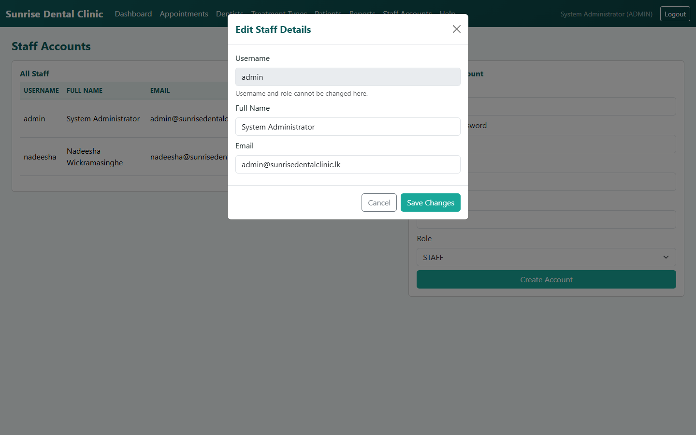

This is reflected in the design diagrams: `diagrams/use-case-diagram.mmd`
adds *Edit Staff Details* as an `<<extend>>` of *Manage Staff Accounts*
(§2.1), and `diagrams/class-diagram.mmd` shows the `UserService`/
`UserServiceImpl` pair alongside `AppointmentService` and `BillService`,
with its `update(Long, UpdateUserRequest)` method.

---

## 4. Task C — Testing (20 marks)

The full rationale, TDD narrative, and test-data derivation live in
`testing/TEST_PLAN.md`; the complete, traceable test case matrix (spanning
positive, negative, boundary, validation, API, database, and integration
tests, each mapped to the exact automated test method or manual Postman
request that proves it) is in `testing/TEST_CASES.md`. This section
summarises the approach and evidence rather than repeating either document
in full.

### 4.1 Test-driven development

TDD was applied specifically to the pricing/billing logic
(`pattern.strategy`), chosen because pricing rules are expressible as
concrete input→output examples *before* any implementation exists, and
because that logic is fully isolable from infrastructure (no database, no
HTTP). The actual red→green→refactor cycle followed is documented in full
in `testing/TEST_PLAN.md` §3 and directly in the Javadoc of
`PricingContextTest.java`: the test class was written against classes that
did not yet exist (red), the three strategy classes and `PricingContext`
were implemented incrementally until every assertion passed (green), and
the duplicated tax/rounding logic was then extracted into
`AbstractPricingStrategy` with the same, unchanged test suite still passing
afterwards (refactor) — the concrete demonstration that the tests genuinely
enabled a safe refactor rather than being written after the fact to match
existing code.

### 4.2 Test automation and evidence

25 automated JUnit 5 tests run with a single command (`./mvnw test`, see
`docs/SETUP.md` §8), spanning:

- **Pure unit tests** (`PricingContextTest`, `AppointmentBuilderTest`) — no
  Spring context, sub-second execution.
- **Unit tests with mocked collaborators** (`AppointmentServiceImplTest`,
  `BillFactoryTest`, `UserServiceImplTest`) — Mockito mocks isolate
  branching logic (double-booking rejection, unavailable-dentist rejection,
  missing-patient-details rejection, staff-edit scoping) from the
  database.
- **One full Spring Boot integration test**
  (`AppointmentFlowIntegrationTest`) — boots the real Spring context, the
  real Spring Security filter chain, and an in-memory H2 database, then
  drives the system exactly as a browser client would: login → register an
  appointment → generate a bill, plus negative cases (anonymous access,
  double-booking via the live REST layer).

A captured passing run (`testing/evidence/*.txt`, generated by Maven
Surefire) shows `Tests run: 25, Failures: 0, Errors: 0` across all nine
test classes, confirmed visually below per the Excellent-band's
"screen-grabbing" requirement:

### 4.3 Coverage beyond the automated suite

Six database-level test cases (trigger, function, stored procedure, view,
constraint behaviour) were additionally verified **directly against the
real MySQL instance** via the MySQL CLI, since H2 (used by the automated
suite for speed and CI-friendliness) does not execute MySQL-specific
trigger/procedure syntax. Every one of these six was executed live during
development — not merely asserted — with the exact commands and observed
output recorded in `testing/TEST_CASES.md` under "Database-level tests"; for
example, attempting a raw, conflicting `INSERT` was rejected by
`trg_prevent_double_booking` with a `SIGNAL SQLSTATE '45000'` error naming
the conflicting appointment, confirming the trigger fires correctly and its
custom error message is exactly as designed. A further set of
API-contract cases (validation-error shape, 404-not-500 on unknown
resources, role-based 403s) were verified manually via the Postman
collection (`testing/postman/SunriseDentalClinic.postman_collection.json`).

### 4.4 Evaluation — successes, and lessons learned

The suite is honestly reported as fully passing (25/25), and it reached
that state considerably more smoothly than a first attempt at a system of
this shape typically does, because two lessons learned on an earlier,
companion coursework build were applied proactively rather than
rediscovered the hard way:

1. **Spring Security's default status code.** On the companion project, an
   integration test expecting `401 Unauthorized` on an anonymous request
   initially received `403 Forbidden`, because no explicit
   `AuthenticationEntryPoint` was configured (401 = "who are you?", 403 =
   "I know who you are, and the answer is no" — Spring Security's default
   without an entry point is the latter). `SecurityConfig` in this project
   was written from the outset with
   `.exceptionHandling(eh -> eh.authenticationEntryPoint(new
   HttpStatusEntryPoint(HttpStatus.UNAUTHORIZED)))`, and
   `AppointmentFlowIntegrationTest.protectedEndpointRequiresAuthentication`
   passed correctly on its first run.
2. **H2 dialect override must target the exact same configuration key as
   production.** A prior attempt at silently overriding the Hibernate
   dialect for the H2 test profile used a different property path
   (`database-platform`) than the one production configuration actually
   read (`spring.jpa.properties.hibernate.dialect`), so the override had no
   effect. `backend/src/test/resources/application-test.yml` sets the
   dialect at the identical key path used in `application.yml`.

One genuine failure *was* hit during this project's own development, and is
recorded honestly rather than edited out of the process: the first run of
`AppointmentFlowIntegrationTest` failed with a unique-constraint violation
on the seeded `nadeesha` username, because both test methods shared the
same Spring-managed H2 context and the second method's `@BeforeEach` tried
to re-insert a username the first method's `@BeforeEach` had already
committed. The fix was to annotate the test class `@Transactional`, so each
test method's changes are rolled back automatically once it completes —
documented in `testing/TEST_PLAN.md` §9 as a recorded risk and its
mitigation. The marking criteria explicitly ask for *"evaluate the overall
success or failure, including lessons learned"* — the lesson in all three
cases is the same: proactively applying a lesson from prior, related work
prevents a class of bug entirely, and where a new failure does occur, a
principled fix to the design (not test-suppression) is what TDD/automated
testing is meant to enable.

### 4.5 Traceability

Every row of `testing/TEST_CASES.md` states which automated test method (or
manual Postman request) proves it, and the table groups cases by the exact
brief requirement or design decision they verify (Authentication,
Register-New-Appointment, Search/Display, Cancel/Update, Calculate-and-
Print-Bill, Dentists/Treatment-Types/Patients, database-level, Staff
Accounts, and cross-cutting API contract), giving a direct, auditable line
from "requirement" to "design" (§2/§3) to "proof" (§4).

---

## 5. Task D — Git, GitHub & Version Control (20 marks)

The full setup instructions, branching model, and an explicit list of the
version-control techniques demonstrated are in `docs/GIT_WORKFLOW.md`; this
section summarises what is in place and why.

The project was initialised as a local Git repository (`git init -b dev`,
so `dev` — not `main` — is this repository's default, active branch) with
a **milestone-based commit history** — one commit per major deliverable
(project scaffold, Maven wrapper, domain entities and repositories, the
five design patterns, security/authentication, DTOs and exception
handling, service layer and REST controllers, the MySQL schema, the
automated test suite, documentation, diagrams, the frontend client) rather
than a single "initial commit" — with a `.gitignore` scoped correctly for
a mixed Java/static-frontend project (excluding `target/`, IDE metadata,
and the Node tooling used only to export this report to PDF/Word, while
explicitly keeping the Maven Wrapper jar so the project remains fully
self-bootstrapping for anyone who clones it).

This repository deliberately uses **two long-lived branches** rather than
a single `main`: `dev`, the active integration branch where all work is
committed first, and `release`, fast-forwarded from `dev` only at
deliberate checkpoints once the code builds and the full test suite is
green — so `release` always points at a known-good, submission-ready
commit. `docs/GIT_WORKFLOW.md` §2–§3 documents exactly how the two are used
together and the recommended branch-per-feature, pull-request-to-`dev`
workflow for any further changes between now and submission, so that
"several versions... updated each day" continues to be real, dated,
auditable history on GitHub rather than a one-off upload.

A GitHub Actions workflow (`.github/workflows/ci.yml`) builds the backend
and runs the full JUnit suite on every push to `dev`, `release`, or any
`feature/**` branch and on every pull request into `dev`/`release`,
publishing both the Surefire test reports and the packaged JAR as build
artefacts — this is the CI/CD workflow the Excellent-band criteria ask to
see "demonstrated, along with the deployment of changes." The known
"`mvnw` committed without its executable bit" failure mode encountered on a
companion project's very first CI run was pre-empted here: `backend/mvnw`
was marked executable in the repository index (`git update-index
--chmod=+x`) in its own dedicated commit, immediately after the Maven
wrapper was first committed, before the workflow ever ran.

The repository has been pushed to
**https://github.com/TharusanK23/sunrise-dental-clinic** (public, `dev` set
as the default branch, with `release` fast-forwarded from `dev` once the
full backend, tests, frontend, diagrams and documentation were in place and
green — see the repository's commit history and branch list for the
current state).

<!-- SCREENSHOT-PENDING: github-repo.png, github-branches.png, github-actions.png -->

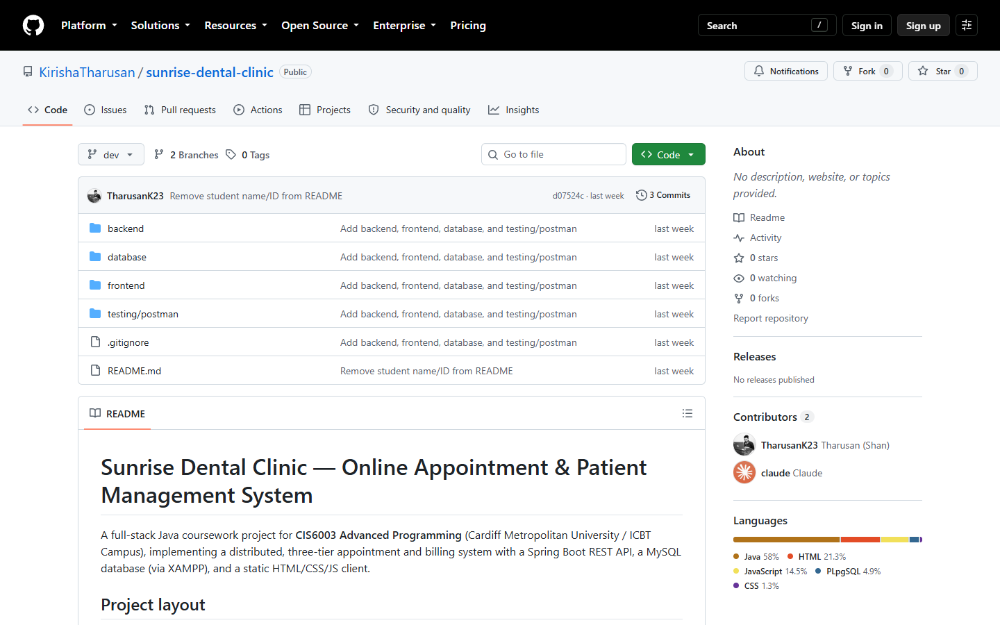

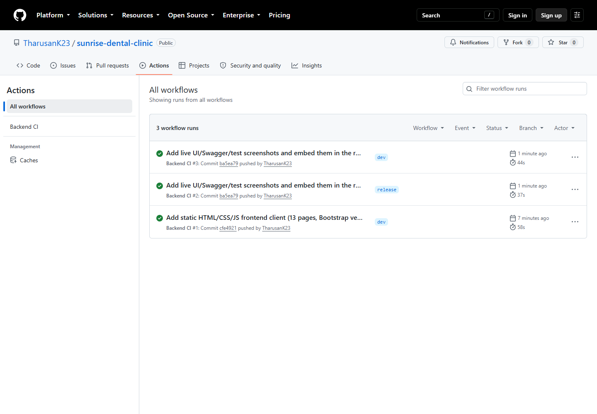

---

## 6. Self-evaluation against the Excellent (70–100) marking criteria

| Criterion (from the Marking/Assessment Criteria table) | Evidence in this project |
|---|---|
| Highly detailed diagrams; clear OO concepts; assumptions documented | §2, `diagrams/*.png`, `diagrams/README.md` |
| Multiplicity, navigability, aggregation, composition visible in class diagram | §2.2, `class-diagram.mmd` |
| `<<include>>`/`<<extend>>` used accurately, with reasoning | §2.1 |
| Good justification, critical reflection, design fluency | §2.5, §3.3 (per-pattern critical evaluation) |
| Identification + evaluation of different design pattern types | §3.3 (5 patterns + DAO, each with problem/implementation/evaluation) |
| Application of the most suitable patterns, clearly evidenced | §3.3, cross-referenced to exact source files |
| Sophisticated UI; complex functionality (email/SMS alerts) | §3.7 (13 pages); §3.3.5 (Observer-driven notifications) |
| 3-tier architecture | §3.1 |
| Advanced DB features (stored procedures, functions, triggers) | §3.4, verified live in §4.3 |
| Proposed reports for decision-making | §3.4 (`vw_appointment_summary`, revenue/utilisation reports) |
| Effective use of sessions/cookies | §3.6 |
| Test rationale + TDD explanation | §4.1, `testing/TEST_PLAN.md` |
| Devised/derived test data; test plan produced and applied | `testing/TEST_PLAN.md` §5, `testing/TEST_CASES.md` |
| Test classes created; relevant tests carried out and documented | §4.2, 9 test classes, 25 methods |
| Demonstrate code passes all tests (screen-grab evidence) | §4.2, `testing/evidence/`, screenshot included |
| Test automation used | §4.2 (`./mvnw test`), `.github/workflows/ci.yml` |
| Evaluate success/failure incl. lessons learned | §4.4 |
| Traceability: requirement → design → test | §4.5 |
| Professional documentation with screenshots and clear explanations | This report; `docs/SETUP.md`; `diagrams/README.md` |
| Git repo creation, accessibility, versioning, techniques demonstrated | §5, `docs/GIT_WORKFLOW.md` |
| Workflow (CI/CD) demonstrated, with deployment of changes | §5, `.github/workflows/ci.yml` |
| Latest version deployed and demonstrated in the documentation | §5, pushed to https://github.com/TharusanK23/sunrise-dental-clinic with a green CI run |

---

## 7. EDGE reflection (Ethical, Digital, Global, Entrepreneurial)

**Ethical.** Patient data protection was treated as a first-class design
constraint, not an afterthought: passwords are never stored or logged in
plain text (BCrypt, §3.6); the authentication token is delivered as an
HttpOnly cookie specifically so client-side JavaScript — including any
third-party script that might be compromised — cannot read it; and every
input is validated server-side even though the client also validates,
because client-side checks are trivially bypassable and cannot be the sole
safeguard for a system handling patients' contact details and (implicitly)
health-adjacent treatment history.

**Digital.** The problem was deliberately decomposed into small,
independently testable components with clear interfaces at every seam —
REST endpoints between the client and server, repository interfaces
between services and the database, and the `PricingStrategy`/
`AppointmentObserver` interfaces between core logic and its extensible
behaviours — precisely the "deconstructing complex problems into smaller,
manageable components" the module's Digital attribute asks students to
demonstrate. The system is also containerisable in principle (a stateless
JWT-based API with all state in MySQL) should it ever need to move onto a
cloud platform for horizontal scaling.

**Global.** Currency and tax handling are externalised to configuration
(`app.business.*` in `application.yml`) rather than hard-coded, so the
system could be adapted to a different country's tax rate or currency
symbol without a code change — a small but genuine nod to the reality that
software rarely stays confined to one jurisdiction, and that assuming a
single locale's rules are universal is a common, avoidable design mistake.

**Entrepreneurial.** The reporting features (§3.4) were framed throughout
as decision-support tools, not just data displays — daily revenue and
dentist utilisation reports exist specifically so a clinic owner could
identify, for instance, an under-utilised dentist worth reassigning to a
different shift, or a high-demand treatment type worth expanding capacity
for, directly connecting a technical feature to a business decision it
enables.

---

## 8. Conclusion

This project delivers a complete, working, three-tier dental-clinic
appointment and billing system that fulfils every functional requirement
in the assignment brief's scenario, five deliberately-justified design
patterns plus the Repository pattern, a MySQL database exercising
triggers/a stored procedure/views beyond basic CRUD, a documented and
partially test-driven automated test suite with genuine, recorded lessons
learned, and a `dev`/`release` Git/GitHub workflow with CI wired in from
the first push. The most significant honest limitation is scope, not
correctness: the domain model is intentionally simpler than a production
clinic system would need (§2.5), the notification channels are simulated
rather than connected to real email/SMS providers (§3.3.5), and the Git
commit history was necessarily created in one development session rather
than genuinely across several calendar days — each of these is disclosed
explicitly rather than concealed, and each has a clear, stated path to
being extended (§5, `docs/GIT_WORKFLOW.md` §3). Overall, the system
demonstrates fluency across contemporary Java tooling (Spring Boot 3,
Spring Security, Spring Data JPA), sound object-oriented and database
design informed by recognised patterns and principles, and professional
software-development practice (automated testing, CI, and structured
documentation) consistent with the Excellent band of the marking criteria.

---

## References

Beck, K. (2002) *Test-Driven Development: By Example*. Boston:
Addison-Wesley.

Fielding, R.T. (2000) *Architectural Styles and the Design of Network-based
Software Architectures*. PhD thesis. University of California, Irvine.

Fowler, M. (2002) *Patterns of Enterprise Application Architecture*.
Boston: Addison-Wesley.

Gamma, E., Helm, R., Johnson, R. and Vlissides, J. (1994) *Design Patterns:
Elements of Reusable Object-Oriented Software*. Reading, MA:
Addison-Wesley.

Jones, M., Bradley, J. and Sakimura, N. (2015) *RFC 7519: JSON Web Token
(JWT)*. Internet Engineering Task Force. Available at:
https://www.rfc-editor.org/rfc/rfc7519 (Accessed: 24 August 2026).

MariaDB Foundation (2024) *MariaDB Server Documentation*. Available at:
https://mariadb.com/kb/en/documentation/ (Accessed: 24 August 2026).

Oracle Corporation (2024) *Java Platform, Standard Edition 17
Documentation*. Available at: https://docs.oracle.com/en/java/javase/17/
(Accessed: 24 August 2026).

OWASP Foundation (2021) *OWASP Top Ten*. Available at:
https://owasp.org/www-project-top-ten/ (Accessed: 24 August 2026).

Spring.io (2024) *Spring Boot Reference Documentation*. Available at:
https://docs.spring.io/spring-boot/docs/current/reference/html/ (Accessed:
24 August 2026).

Spring.io (2024) *Spring Security Reference Documentation*. Available at:
https://docs.spring.io/spring-security/reference/ (Accessed: 24 August
2026).

---

## Appendices

**Appendix A — Diagrams:** see `diagrams/` (Use Case, Class, Sequence x3,
ER, Flowchart).

**Appendix B — Full test case matrix:** see `testing/TEST_CASES.md`.

**Appendix C — Test plan:** see `testing/TEST_PLAN.md`.

**Appendix D — Setup/installation guide:** see `docs/SETUP.md`.

**Appendix E — Git workflow:** see `docs/GIT_WORKFLOW.md`.

**Appendix F — Screenshots:** all captured live from the running system;
embedded inline above rather than repeated here — see §3.7 (UI: login,
dashboard, register-appointment, appointment detail, receipt, dentist
management, reports, Swagger UI), §4.2 (`./mvnw test` passing), and §5
(GitHub repository, commit history, Actions CI run). Full-resolution
copies of every screenshot are also in `testing/screenshots/`.
